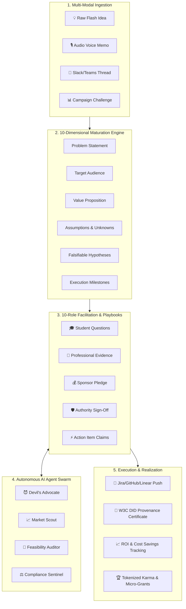
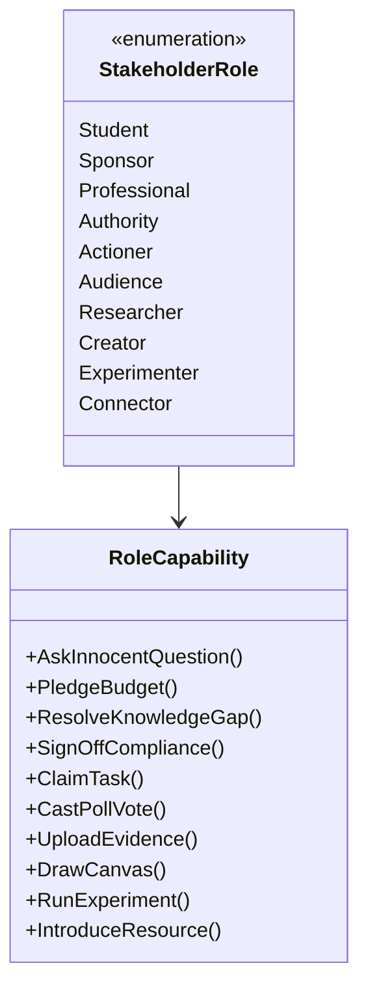
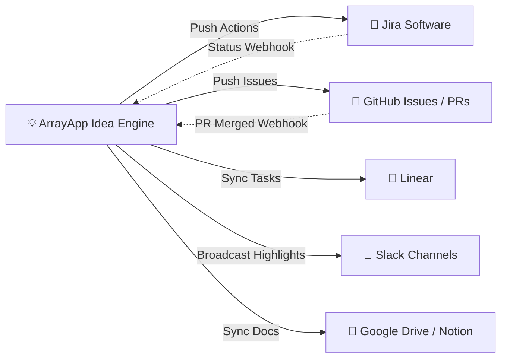

# 🚀 ArrayApp (IdeaApp) — Master User Stories & Technical Specification

> **ArrayApp (IdeaApp)** is the world's most advanced **Autonomous Collaborative Innovation Operating System (ACIOS)**. It transforms raw, nascent thoughts into fully mature, de-risked, budgeted, and executed product deliverables through multi-stakeholder dynamic facilitation, continuous AI agent swarms, spatial interactive canvases, and automated enterprise workstream pipelines.

---

## 📑 Table of Contents

1. [System Architecture & Innovation Lifecyle Overview](#-system-architecture--innovation-lifecycle-overview)
2. [Epic 1: The 10-Dimensional Idea Product Maturation Engine](#-epic-1-the-10-dimensional-idea-product-maturation-engine)
3. [Epic 2: The 10-Role Specialized Stakeholder Capacity Matrix](#-epic-2-the-10-role-specialized-stakeholder-capacity-matrix)
4. [Epic 3: Multi-Format Workshop & Playbook Automation Engine](#-epic-3-multi-format-workshop--playbook-automation-engine)
5. [Epic 4: Autonomous AI Agent Swarm & Real-Time Co-Pilots](#-epic-4-autonomous-ai-agent-swarm--real-time-co-pilots)
6. [Epic 5: Spatial 2D Infinite Canvas & Generative Whiteboard](#-epic-5-spatial-2d-infinite-canvas--generative-whiteboard)
7. [Epic 6: Live WebRTC Audio/Video, Diarization & Speech Action Extraction](#-epic-6-live-webrtc-audiovideo-diarization--speech-action-extraction)
8. [Epic 7: Enterprise Integration Mesh & Bi-Directional No-Code Connectors](#-epic-7-enterprise-integration-mesh--bi-directional-no-code-connectors)
9. [Epic 8: Verifiable Provenance, W3C DIDs & Immutable Realization Ledger](#-epic-8-verifiable-provenance-w3c-dids--immutable-realization-ledger)
10. [Epic 9: Tokenized Innovation Economy, Prediction Markets & Gamification](#-epic-9-tokenized-innovation-economy-prediction-markets--gamification)
11. [Epic 10: Executive Innovation Pipeline, Portfolio Risk & ROI Analytics](#-epic-10-executive-innovation-pipeline-portfolio-risk--roi-analytics)
12. [Epic 11: Zero-Trust Security, ABAC Governance & Multi-Tenant Isolation](#-epic-11-zero-trust-security-abac-governance--multi-tenant-isolation)
13. [Epic 12: Offline-First CRDT Synchronization & Edge Client Engine](#-epic-12-offline-first-crdt-synchronization--edge-client-engine)

---

## 🏗️ System Architecture & Innovation Lifecycle Overview

---

## 💎 Epic 1: The 10-Dimensional Idea Product Maturation Engine

### 📖 Context & Purpose
Ideas fail when they remain vague bullet points. ArrayApp treats every idea as a structured, evolving 10-dimensional living product artifact with real-time health scoring, automated gap analysis, and composite ICE/RICE prioritization.

---

### User Story 1.1: 10-Dimensional Idea Structuring & Dynamic Completeness Scoring
- **As a** Product Innovator or Domain Expert,
- **I want to** systematically document my idea across all 10 core dimensions (Problem, Opportunity, Hypothesis, Target Audience, Value Proposition, Constraints, Unknowns, Supporting Evidence, Key Questions, Desired Outcome),
- **So that** my idea is rigorously vetted, unambiguous, and ready for immediate stakeholder commitment.

#### Acceptance Criteria
- [ ] **10-Dimension Form & Schema Validation**:
  - `Problem`: Quantified pain point with root-cause analysis (5-Whys).
  - `Opportunity`: Total addressable value (TAM/SAM/SOM), revenue potential, or operational savings.
  - `Hypothesis`: Falsifiable format (*"If we build X for user Y, then Z will happen, measured by metric M"*).
  - `Target Audience`: Primary/secondary personas with behavioral demographics.
  - `Value Proposition`: Explicit "before vs. after" delta and unfair competitive advantage.
  - `Constraints`: Regulatory, technical, budgetary, and timeline limitations.
  - `Unknowns`: Explicitly tagged knowledge gaps categorized by domain.
  - `Supporting Evidence`: Benchmarks, customer quotes, academic papers, and analytics URLs.
  - `Key Questions`: Open exploratory queries for facilitator discovery.
  - `Desired Outcome`: Clear Definition of Done (DoD) with success metric thresholds.
- [ ] **Maturity Index Computation**: System computes a dynamic score (0–100%) based on field density, citation credibility, and resolved knowledge gaps.
- [ ] **Automated ICE / RICE Formula Engine**:
  $$\text{ICE Score} = \frac{\text{Impact} \times \text{Confidence} \times \text{Ease}}{10}$$
  $$\text{RICE Score} = \frac{\text{Reach} \times \text{Impact} \times \text{Confidence}}{\text{Effort}}$$
- [ ] **Continuous Auto-Save & Debounced Persistence**: Every keystroke is saved via debounced WebAPI calls with optimistic UI updates.

#### 🤓 Geekout Technical Specifications
- **Entity Model**: `Idea`, `IdeaProductMaturationRecord`, `DimensionScoreBreakdown`.
- **Validation Engine**: `FluentValidation` validator checking dimensional word counts and structured citation links.
- **REST Endpoints**:
  - `GET /api/ideaproducts/{id}/dimensions` $\rightarrow$ `IdeaProductDto`
  - `PUT /api/ideaproducts/{id}/dimensions` $\rightarrow$ Updates 10 dimensions, recalculates ICE score, and emits SignalR `OnIdeaDimensionsUpdated`.

---

### User Story 1.2: Lineage Tree, Forking & Intelligent Duplicate Merging
- **As an** Innovation Director,
- **I want to** fork existing ideas, create lineage trees, and semantically merge duplicated proposals,
- **So that** duplicate work is eliminated and community ideas build upon previous foundational research.

#### Acceptance Criteria
- [ ] **One-Click Idea Forking**: Clones the 10 dimensions while establishing a permanent parent-child lineage pointer (`ForkedFromIdeaId`).
- [ ] **AI-Assisted Semantic Diffing**: Visual side-by-side diffing showing changes between original and forked proposals.
- [ ] **Three-Way Merge Engine**: Facilitator can merge two converging ideas into a unified master proposal with preserved historical attribution for both original authors.
- [ ] **Vector Similarity Cluster Detection**: Uses cosine similarity over OpenAI/local embeddings ($> 0.82$ threshold) to alert authors of similar active proposals upon typing.

---

## 👥 Epic 2: The 10-Role Specialized Stakeholder Capacity Matrix

### 📖 Context & Purpose
Brainstorming stalls when participants don't know how to contribute. ArrayApp equips every user with a designated role equipped with bespoke action capabilities, reputation incentives, and real-time palette controls.

---

### User Story 2.1: Specialized Role Execution & Live SignalR Broadcasts
- **As a** Participant with an assigned Stakeholder Role,
- **I want to** execute actions native to my role's capacity palette,
- **So that** my specialized perspective directly advances the idea's maturity while earning reputation points.

#### Acceptance Criteria & Role Action Palettes
| Role | Action Capability | Payload / Output | System Side-Effect |
| :--- | :--- | :--- | :--- |
| **🎓 Student** | `AskInnocentQuestion` | Naive assumption-testing query | Adds to `KeyQuestions`, triggers AI Socratic reframing |
| **💰 Sponsor** | `PledgeSponsorship` | Financial amount, compute, or team FTEs | Updates `RewardPool`, logs financial commitment |
| **💼 Professional** | `ResolveKnowledgeGapLive` | Domain resolution + citation URL | Closes `KnowledgeGap`, elevates Confidence Score |
| **🛡️ Authority** | `AuthoritySignoff` | Compliance / legal clearance badge | Unlocks stage transition to "Building" |
| **⚡ Actioner** | `ClaimAction` | Task claim with committed ETA | Creates `IdeaAction`, syncs to Jira/GitHub |
| **👏 Audience** | `SendFloatingReaction` / `CastVote` | Particle emojis, quadratic votes | Updates real-time heatmaps & crowd sentiment |
| **🔬 Researcher** | `PublishResearchEvidence` | Whitepaper, competitor data, benchmark | Links to `SupportingEvidence`, increases ICE |
| **🎨 Creator** | `UpdateCanvasArtifact` | Visual diagrams, wireframes, flowcharts | Synchronizes spatial nodes across live clients |
| **🧪 Experimenter**| `LogExperimentMetric` | Hypothesis test result, sample size, p-value | Validates hypothesis, transitions to "Validated" |
| **🤝 Connector** | `IntroduceResourceLead` | External partner/expert recommendation | Sends invite notification & establishes link |

#### 🤓 Geekout Technical Specifications
- **Service Abstraction**: `IRoleCapacityService` (`src/Application/Common/Interfaces/IIdeaServices.cs`).
- **SignalR Hub**: `IdeaSessionHub` broadcasting `OnStudentQuestionAsked`, `OnSponsorshipPledged`, `OnKnowledgeGapResolved`, `OnAuthoritySignedOff`, etc.
- **REST Endpoints**:
  - `POST /api/rolecapacity/execute` $\rightarrow$ `{ ideaId, role, actionType, payload }`
  - `GET /api/rolecapacity/history/{ideaId}` $\rightarrow$ Audit trail of all role contributions.

---

## 🎲 Epic 3: Multi-Format Workshop & Playbook Automation Engine

### 📖 Context & Purpose
Unstructured meetings waste time. ArrayApp provides automated facilitation agendas that guide live sessions step-by-step through industry-standard brainstorming frameworks with automated timers, phase transitions, and visual canvas presets.

---

### User Story 3.1: Guided Facilitator Playbooks & Timed Phase Transitions
- **As a** Session Facilitator,
- **I want to** select and run pre-configured workshop playbooks (SCAMPER, Six Thinking Hats, Crazy 8s, Rapid 90-min Sprint),
- **So that** all attendees are synchronized through timed divergent and convergent thinking sprints.

#### Playbook Specifications Matrix

```mermaid
gantt
    title Six Thinking Hats 75-Minute Facilitation Agenda
    dateFormat  m
    axisFormat %M min
    section Blue Hat
    Set Objectives & Ground Rules :0, 10
    section White Hat
    Data & Information Gathering  :10, 20
    section Yellow Hat
    Optimism & Value Proposition  :20, 30
    section Black Hat
    Critical Risk & Premortem     :30, 45
    section Green Hat
    Creative Lateral Ideation     :45, 60
    section Red Hat
    Intuition & Gut Voting        :60, 68
    section Blue Hat
    Action Extraction & Next Steps:68, 75
```

- [ ] **SCAMPER Facilitation (60 min)**: S (Substitute) $\rightarrow$ C (Combine) $\rightarrow$ A (Adapt) $\rightarrow$ M (Modify/Magnify) $\rightarrow$ P (Put to other uses) $\rightarrow$ E (Eliminate) $\rightarrow$ R (Rearrange).
- [ ] **Six Thinking Hats (75 min)**: White (Facts) $\rightarrow$ Yellow (Benefits) $\rightarrow$ Black (Risks) $\rightarrow$ Green (Creativity) $\rightarrow$ Red (Feelings) $\rightarrow$ Blue (Process control).
- [ ] **Crazy 8s Sketching (20 min)**: 8 distinct ideas sketched in 8 minutes $\rightarrow$ silent gallery walk $\rightarrow$ dot voting.
- [ ] **Investor / Sponsor Pitch (45 min)**: Problem Hook $\rightarrow$ 10-D Walkthrough $\rightarrow$ Financial ROI $\rightarrow$ Q&A $\rightarrow$ Live Sponsorship Pledges.

#### 🤓 Geekout Technical Specifications
- **Service**: `ISessionPlaybookService` (`SessionPlaybookService.cs`).
- **REST Endpoints**:
  - `GET /api/sessionplaybook/templates` $\rightarrow$ List of playbooks with durations and phase steps.
  - `GET /api/sessionplaybook/templates/{formatType}` $\rightarrow$ Deep agenda with prompts and facilitation tips.
  - `POST /api/ideasessions/{id}/advance-phase` $\rightarrow$ Emits SignalR `OnPlaybookPhaseAdvanced`.

---

## 🤖 Epic 4: Autonomous AI Agent Swarm & Real-Time Co-Pilots

### 📖 Context & Purpose
AI shouldn't just be an answering chatbot; it must act as an active, proactive brainstorming participant that challenges assumptions, synthesizes transcripts, and drafts architecture in real time.

---

### User Story 4.1: Specialized Multi-Agent Brainstorming Swarms
- **As a** Session Participant,
- **I want to** summon specialized AI agents into the live session and chatroom,
- **So that** our team gets immediate counter-arguments, technical audit, and market research without waiting days.

#### Agent Archetype Roster
1. **😈 Devil's Advocate (Red Team)**: Aggressively stress-tests assumptions, detects fatal flaws, and performs premortem disaster simulations.
2. **📈 Market Scout & Trend Forecaster**: Ingests industry trends, pulls live competitor data, and models market size.
3. **🔬 Feasibility & Architecture Auditor**: Audits technical stack, latency constraints, database scalability, and API feasibility.
4. **⚖️ Regulatory & Compliance Sentinel**: Identifies GDPR, HIPAA, SOC 2, and patent infringement vulnerabilities.
5. **🧙 IdeaBot Synthesizer (24/7 Co-Pilot)**: Summarizes discussion channels, extracts decisions, and drafts PRDs and Jira epics.

#### 🤓 Geekout Technical Specifications
- **LLM Integration**: Streaming integration supporting OpenAI GPT-4o, Anthropic Claude 3.5 Sonnet, and Gemini 2.0 via async token pipelines.
- **Background Worker**: `AIAgentInsightWorker` continuously listening to chatroom events and generating proactive suggestions when conversation stalls.
- **REST Endpoints**:
  - `POST /api/aiagents/invoke` $\rightarrow$ `{ ideaId, sessionId, agentType, customPrompt }`
  - `GET /api/aiagents/insights/{ideaId}` $\rightarrow$ Pinned insights, confidence scores, and raw prompts.

---

## 🎨 Epic 5: Spatial 2D Infinite Canvas & Generative Whiteboard

### 📖 Context & Purpose
Visual thinkers need spatial layout freedom. ArrayApp provides an infinite 2D multiplayer vector canvas that combines sticky notes, mind maps, live cursors, and AI generative wireframing.

---

### User Story 5.1: Real-Time Multiplayer 2D Infinite Canvas
- **As a** Creative Designer or Architect,
- **I want to** collaborate on a shared 2D canvas with live multiplayer cursors, sticky notes, connectors, and auto-clustering,
- **So that** complex visual diagrams and user journey flows can be co-created seamlessly.

#### Acceptance Criteria
- [ ] **Multiplayer Presence**: See other users' cursors moving with $< 50\text{ ms}$ latency via SignalR binary WebSockets.
- [ ] **Node Types**: Sticky Notes, MindMap Nodes, Decision Diamonds, Action Cards, Media Embeds, and Grouping Frames.
- [ ] **AI Semantic Auto-Clustering**: One-click button that groups 50+ scattered sticky notes into thematic affinity clusters using vector embeddings.
- [ ] **Generative Mermaid / PlantUML Rendering**: Type text or speak $\rightarrow$ AI instantly renders interactive UML sequence and flow diagrams directly onto the canvas.
- [ ] **Infinite Pan & Zoom**: Smooth 60fps pan/zoom from $10\%$ overview to $500\%$ micro-detail with mini-map navigation.

---

## 🎙️ Epic 6: Live WebRTC Audio/Video, Diarization & Speech Action Extraction

### 📖 Context & Purpose
Switching to Zoom or Google Meet breaks innovation context. ArrayApp provides built-in WebRTC audio/video rooms with real-time speech-to-text diarization and autonomous decision extraction.

---

### User Story 6.1: Native Video Meeting with Live AI Diarization
- **As an** Innovation Team Member,
- **I want to** join live video/audio calls inside the Idea Session with real-time automated transcription,
- **So that** our spoken discussions are automatically transformed into permanent decisions and tasks.

#### Acceptance Criteria
- [ ] **SFU-Based WebRTC Video**: Grid view supporting up to 50 active participants with screen sharing.
- [ ] **Speaker Diarization**: Labels live speech transcripts per speaker (*"Damilola (Sponsor): We are allocating \$50k for Phase 1"*).
- [ ] **Real-Time Natural Language Action Parsing**:
  - Detects patterns like *"I will build the prototype by next Friday"* $\rightarrow$ creates a popup proposing an `IdeaAction` assigned to that user with due date auto-populated.
- [ ] **Instant Session Summary Generation**: Once the meeting ends, generates an executive 1-page summary with key decisions, dissenting opinions, and next steps.

---

## 🔌 Epic 7: Enterprise Integration Mesh & Bi-Directional No-Code Connectors

### 📖 Context & Purpose
Ideas must flow directly into production toolchains without manual copy-pasting. ArrayApp acts as an innovation hub pushing and syncing with Jira, Asana, Linear, GitHub, and Slack.

---

### User Story 7.1: Bi-Directional Project Management Sync
- **As an** Engineering Lead or Scrum Master,
- **I want to** push approved actions to Jira / GitHub / Linear and have status changes in Jira automatically reflect in ArrayApp,
- **So that** innovation outcomes are tracked through to production deployment.

#### Acceptance Criteria
- [ ] **Supported Integrations**: Jira Cloud, GitHub Issues/PRs, Linear, Asana, Monday.com, Trello, Slack, Microsoft Teams, Webhooks.
- [ ] **Bi-Directional Status Webhook**: When a developer marks a GitHub PR as merged or Jira ticket as `Done`, ArrayApp automatically updates the corresponding `IdeaAction.Status` to `Completed` and triggers reputation rewards.
- [ ] **Configurable Custom Field Mapping**: Map ArrayApp 10 dimensions to Jira Custom Fields or Notion Database Properties.

---

## 📜 Epic 8: Verifiable Provenance, W3C DIDs & Immutable Realization Ledger

### 📖 Context & Purpose
Intellectual property disputes and lack of recognition kill innovation morale. ArrayApp provides cryptographic auditability and verifiable realization certificates.

---

### User Story 8.1: Hash-Chained Provenance Logs & W3C DID Certificates
- **As an** Inventor or Corporate Legal Auditor,
- **I want to** have an immutable, hash-chained audit log of every contribution and download a cryptographically signed Realization Certificate,
- **So that** authorship, intellectual property rights, and contribution provenance are indisputable.

#### Acceptance Criteria
- [ ] **Hash-Chained Audit Ledger**: Every provenance entry hashes the previous entry's SHA-256 hash, creating an immutable internal chain:
  $$H_n = \text{SHA256}(H_{n-1} \parallel \text{Actor} \parallel \text{Action} \parallel \text{Timestamp} \parallel \text{Payload})$$
- [ ] **W3C DID Verifiable Credentials**: Realization Certificates issued as JSON-LD Verifiable Credentials signed with Ed25519 corporate keys.
- [ ] **Tamper-Evident Verification Endpoint**: `GET /api/provenance/verify/{ideaId}` validates the entire cryptographic chain and flags any corrupted or modified records.
- [ ] **Downloadable PDF & Vector Badge**: Generates high-res verifiable certificate with QR code linking to the live cryptographic verification URL.

---

## 🏆 Epic 9: Tokenized Innovation Economy, Prediction Markets & Gamification

### 📖 Context & Purpose
Innovation requires intrinsic and extrinsic motivation. ArrayApp introduces an internal tokenized karma economy with quadratic voting and prediction markets.

---

### User Story 9.1: Quadratic Voting & Idea Prediction Markets
- **As an** Innovation Program Director,
- **I want to** allocate voting credits to users for Quadratic Voting and run internal Prediction Markets on idea implementation success,
- **So that** the organization surfaces genuinely transformative ideas rather than just politically popular ones.

#### Acceptance Criteria
- [ ] **Quadratic Voting Mechanism**:
  $$\text{Cost to User} = (\text{Votes Cast})^2$$
  *(1 vote = 1 credit, 2 votes = 4 credits, 5 votes = 25 credits)*, preventing loud minorities from overpowering collective consensus.
- [ ] **Internal Prediction Markets**: Users wager non-monetary Karma points on whether an idea will achieve its revenue/cost savings target within 6 months.
- [ ] **Dynamic Reputation Badges**: Automatically unlocks badges (*"Catalyst"*, *"Devil's Advocate"*, *"Closer"*, *"Seed Sponsor"*, *"Domain Oracle"*).
- [ ] **Micro-Grant / Bounty Allocation**: Sponsors can attach dollar bounties to specific `KnowledgeGap` or `IdeaAction` items.

---

## 📊 Epic 10: Executive Innovation Pipeline, Portfolio Risk & ROI Analytics

### 📖 Context & Purpose
Executives need clear ROI visibility: how much money was saved, what revenue was generated, and where pipeline bottlenecks exist.

---

### User Story 10.1: Executive Innovation ROI & Pipeline Velocity Dashboard
- **As an** Executive (CEO, CTO, Head of Innovation),
- **I want to** view real-time portfolio analytics showing pipeline velocity, conversion rates, and realized financial ROI,
- **So that** I can justify innovation investments to the Board of Directors.

#### Acceptance Criteria
- [ ] **10-Stage Pipeline Funnel**: Tracks idea drop-off across Raw $\rightarrow$ Exploring $\rightarrow$ Structured $\rightarrow$ Validating $\rightarrow$ Experimenting $\rightarrow$ Planned $\rightarrow$ Building $\rightarrow$ Implemented $\rightarrow$ Measured $\rightarrow$ Evolving.
- [ ] **Net Financial Impact Tracker**: Aggregates verified cost savings + incremental revenue across all realized ideas.
- [ ] **Velocity Metric (Average Time-to-Action)**: Measures the hours/days from raw idea submission to the first committed action item.
- [ ] **Portfolio Risk / Impact Matrix**: Interactive scatter plot placing ideas across High/Low Impact vs High/Low Complexity.

---

## 🛡️ Epic 11: Zero-Trust Security, ABAC Governance & Multi-Tenant Isolation

### 📖 Context & Purpose
Enterprise ideas contain proprietary trade secrets. ArrayApp enforces zero-trust architecture, attribute-based access control (ABAC), and confidential computing standards.

---

### User Story 11.1: Attribute-Based Access Control (ABAC) & Confidential Enclaves
- **As an** Enterprise CISO,
- **I want to** restrict access to sensitive idea dimensions based on user clearance, department, and geography,
- **So that** trade secrets and unreleased patents remain strictly confidential.

#### Acceptance Criteria
- [ ] **ABAC Security Policies**: Fine-grained access policies evaluated at runtime (e.g., *"Financial ROI dimension visible only to Sponsor & Authority roles within Finance Dept"*).
- [ ] **End-to-End Field Encryption (E2EE)**: Sensitive dimensional text fields encrypted at rest with customer-managed AWS KMS / Azure Key Vault keys.
- [ ] **SOC 2 Type II / ISO 27001 Audit Logs**: Immutable audit logs capturing every read, export, edit, and deletion event with IP and device fingerprint.
- [ ] **Multi-Tenant Schema Isolation**: Support for shared database with schema-level or tenant-key row-level security (RLS).

---

## 📱 Epic 12: Offline-First CRDT Synchronization & Edge Client Engine

### 📖 Context & Purpose
Inspiration strikes on flights, in coffee shops, or with spotty Wi-Fi. ArrayApp ensures zero data loss through local-first CRDT (Conflict-free Replicated Data Types) storage.

---

### User Story 12.1: Local-First Offline Editing with CRDT Auto-Resolution
- **As a** Traveling Innovator,
- **I want to** edit my idea, add canvas stickies, and draft action items completely offline,
- **So that** all my changes seamlessly sync and merge without merge conflicts when I reconnect.

#### Acceptance Criteria
- [ ] **IndexedDB Client Storage**: Complete local offline cache of user's active ideas and canvas workspaces via Web Worker.
- [ ] **Yjs / Automerge CRDTs**: Canvas state and rich-text dimensions represented as state vectors that auto-merge concurrently without server locks.
- [ ] **Background Sync API**: Leverages Service Workers to flush queued mutations as soon as network connectivity is restored.
- [ ] **Visual Sync Indicator**: Clear status pill showing `🟢 Synced`, `🟡 Syncing (3 changes queued)`, or `🔴 Offline Mode`.

---

## 🏁 Summary Matrix of Core Capabilities

| Dimension / Area | Legacy Idea Boxes (Old World) | ArrayApp Autonomous Innovation OS (2026+) |
| :--- | :--- | :--- |
| **Idea Structure** | Flat text description + title | **10-Dimensional Living Product Specification** |
| **Prioritization** | Simple thumbs up / down | **Dynamic ICE/RICE + Quadratic Voting + Prediction Markets** |
| **Stakeholder Roles** | Generic submitters & viewers | **10 Specialized Capacities (Student, Sponsor, Authority, etc.)** |
| **Facilitation** | Ad-hoc unguided meetings | **Automated Playbooks (SCAMPER, Six Hats, Crazy 8s, Hackathons)** |
| **AI Integration** | Passive search or generic chatbot | **Active Multi-Agent Swarms (Devil's Advocate, Market Scout, Auditor)** |
| **Workspace** | Static form fields | **Spatial 2D Multiplayer Infinite Canvas + MindMaps** |
| **Audio/Video** | External links to 3rd party apps | **Built-in WebRTC + Speaker Diarization + Speech-to-Action Extraction** |
| **Execution** | Manual copy-pasting to Jira | **Bi-Directional Synced Connectors (Jira, Linear, GitHub, Slack)** |
| **Provenance** | Basic timestamp in SQL table | **Hash-Chained Immutable Ledger + W3C DID Realization Certificates** |
| **Security** | Simple role-based ACLs | **Zero-Trust ABAC + Field-Level Encryption + SOC 2 Type II** |
| **Connectivity** | Online-only browser tabs | **Offline-First CRDT Engine with Background Sync** |

---

*This document serves as the absolute functional, technical, and architectural specification for the ongoing engineering and product evolution of ArrayApp.*
