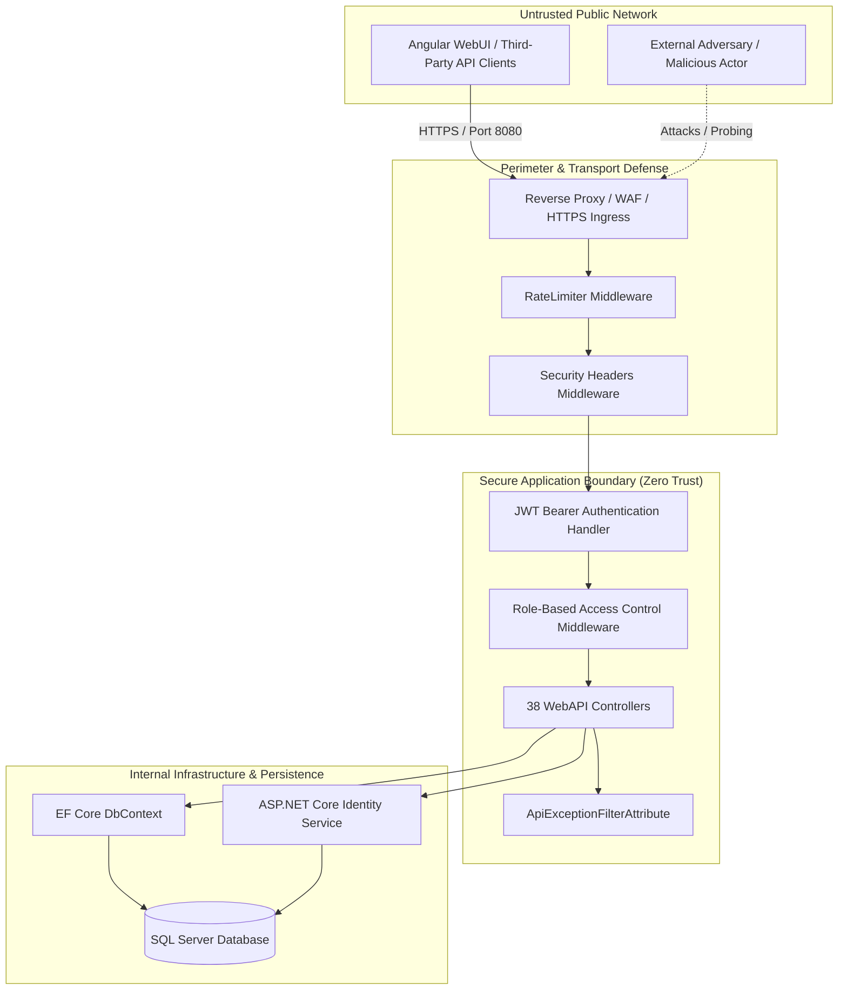

# Architecture Threat Model — ArrayApp

This document summarizes the threat model for ArrayApp, detailing the architecture, trust boundaries, threat actors, and STRIDE risk mitigations.

---

## 1. System Architecture & Trust Boundaries

---

## 2. STRIDE Assessment Summary

| Threat Category | Pre-Remediation Vulnerability | Remediation Applied |
| :--- | :--- | :--- |
| **Spoofing** | Adversary could reset passwords arbitrarily; unauthenticated callers passed fake clearance levels. | Enforced cryptographic reset tokens and claims-based identity derivation. |
| **Tampering** | Insecure 128-bit key allowed offline HMAC forgery. | Mandatory 256-bit symmetric signing keys; issuer & audience checks. |
| **Repudiation** | Audit logs accessible to unauthenticated visitors. | Restricted audit logs to `Administrator` and `SecurityOfficer` roles. |
| **Information Disclosure** | Password hashes in user queries; stack traces in error responses. | DTO sanitization (`UserDto`); RFC 7807 problem details. |
| **Denial of Service** | Unrestricted authentication attempts; sync-over-async blocking. | Fixed-window RateLimiter; pure async/await execution; account lockout. |
| **Elevation of Privilege** | Missing authorization on role creation and assignment. | Strict `[Authorize(Roles = "Administrator,Admin,admin")]` checks. |
