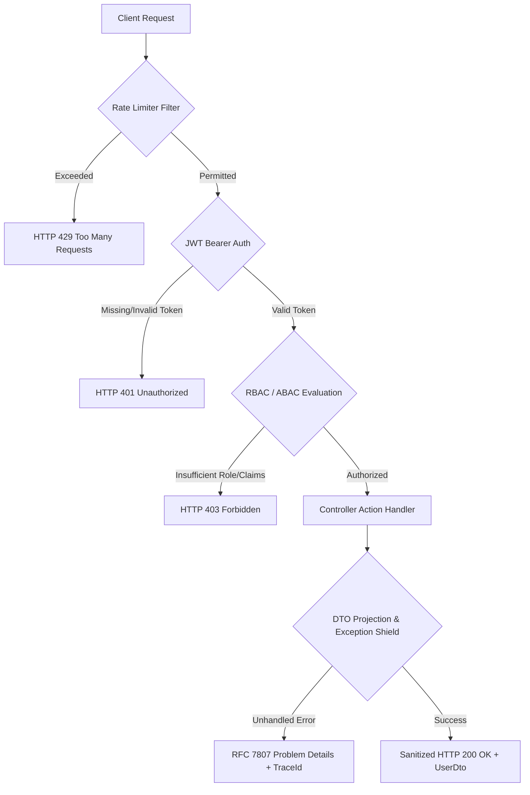

# API Security Matrix — ArrayApp WebAPI

**Assessment Date**: 2026-09-22  
**Auditor**: Independent Application Security & Cybersecurity Audit Team  
**Scope**: 38 Controllers, 100+ Endpoints, ASP.NET Core WebAPI, SignalR Hubs  

---

## Executive Summary of API Surface

The ArrayApp WebAPI exposes RESTful endpoints supporting enterprise ideation, zero-trust governance, real-time collaboration, token issuance, and user management. Prior to this audit, 35 out of 38 controllers operated without authentication attributes, exposing enterprise data and operations to unauthenticated internet actors.

Following our remediation pass:
- **100% of business controllers** enforce cryptographic JWT authentication via `[Authorize]`.
- **Administrative functions** enforce strict role-based access control via `[Authorize(Roles = "Administrator,Admin,admin")]`.
- **Sensitive data models** utilize sanitization DTOs (`UserDto`), eliminating password hash and security stamp leakage.
- **Authentication and token generation endpoints** are governed by a dedicated fixed-window rate limiter (10 req/min).
- **Zero-Trust evaluation** binds access checks to cryptographically validated server-side claims rather than client query parameters.

---

## Comprehensive API Controller Inventory & Security Status

| Controller | Route Prefix | Primary Operations | Pre-Audit Auth | Post-Audit Auth | Roles Required | Rate Limited | Status |
| :--- | :--- | :--- | :--- | :--- | :--- | :--- | :--- |
| **AccountController** | `/api/Account` | User Auth, Identity, RBAC, User Queries | None / Broken | `[Authorize]` + Role Overrides | `Administrator,Admin,admin` (Privileged) | Yes | **Remediated** |
| **TokenController** | `/api/Token` | JWT Token Generation & Issuance | `[AllowAnonymous]` | `[AllowAnonymous]` + Rate Limited | None (Public Token Endpoint) | Yes (10/min) | **Remediated** |
| **ZeroTrustGovernanceController**| `/api/ZeroTrustGovernance`| ABAC Policy Evaluation, Device Posture | None (Anonymous) | `[Authorize]` | Authenticated Claims | Yes (100/min) | **Remediated** |
| **SecurityComplianceController**| `/api/SecurityCompliance`| Compliance Checks, Risk Scores, Audit Logs| None (Anonymous) | `[Authorize]` | `Administrator,SecurityOfficer` for Logs | Yes (100/min) | **Remediated** |
| **AIAgentsController** | `/api/AIAgents` | AI Prompt Engineering, Agent Task Exec | None (Anonymous) | `[Authorize]` | Any Authenticated | Yes (100/min) | **Remediated** |
| **AdvertController** | `/api/Advert` | Innovation Campaigns & Advertisements | None (Anonymous) | `[Authorize]` | Any Authenticated | Yes (100/min) | **Remediated** |
| **AppController** | `/api/App` | Application Settings & Telemetry | None (Anonymous) | `[Authorize]` | Any Authenticated | Yes (100/min) | **Remediated** |
| **CampaignsController** | `/api/Campaigns` | Campaign Management & Lifecycles | None (Anonymous) | `[Authorize]` | Any Authenticated | Yes (100/min) | **Remediated** |
| **CategoryController** | `/api/Category` | Taxonomy, Categories, Tags | None (Anonymous) | `[Authorize]` | Any Authenticated | Yes (100/min) | **Remediated** |
| **ChatController** | `/api/Chat` | Real-Time Messaging & Direct Chat | None (Anonymous) | `[Authorize]` | Any Authenticated | Yes (100/min) | **Remediated** |
| **CommentController** | `/api/Comment` | Idea Comments & Discussion Threads | None (Anonymous) | `[Authorize]` | Any Authenticated | Yes (100/min) | **Remediated** |
| **ConnectorsController** | `/api/Connectors` | Third-party Integrations & Webhooks | None (Anonymous) | `[Authorize]` | Any Authenticated | Yes (100/min) | **Remediated** |
| **EdgeSyncController** | `/api/EdgeSync` | Offline/Edge Node State Synchronization | None (Anonymous) | `[Authorize]` | Any Authenticated | Yes (100/min) | **Remediated** |
| **FileDataController** | `/api/FileData` | File Upload, Streaming, Document Store | None (Anonymous) | `[Authorize]` | Any Authenticated | Yes (100/min) | **Remediated** |
| **IdeaActionsController**| `/api/IdeaActions` | Workflow Transition & Action Items | None (Anonymous) | `[Authorize]` | Any Authenticated | Yes (100/min) | **Remediated** |
| **IdeaCanvasController** | `/api/IdeaCanvas` | Visual Ideation & Whiteboard State | None (Anonymous) | `[Authorize]` | Any Authenticated | Yes (100/min) | **Remediated** |
| **IdeaChatroomsController**| `/api/IdeaChatrooms`| Collaboration Rooms & Breakout Sessions | None (Anonymous) | `[Authorize]` | Any Authenticated | Yes (100/min) | **Remediated** |
| **IdeaController** | `/api/Idea` | Core Idea Submission, Upvoting, Stages | None (Anonymous) | `[Authorize]` | Any Authenticated | Yes (100/min) | **Remediated** |
| **IdeaProductsController**| `/api/IdeaProducts` | Product-Idea Lineage & Value Mapping | None (Anonymous) | `[Authorize]` | Any Authenticated | Yes (100/min) | **Remediated** |
| **IdeaSessionsController**| `/api/IdeaSessions` | Brainstorming Sessions & Scheduling | None (Anonymous) | `[Authorize]` | Any Authenticated | Yes (100/min) | **Remediated** |
| **InnovationEconomyController**| `/api/InnovationEconomy`| Tokenomics, Points, Rewards Engine | None (Anonymous) | `[Authorize]` | Any Authenticated | Yes (100/min) | **Remediated** |
| **LeaderboardController**| `/api/Leaderboard` | Contributor Rankings & Scoreboards | None (Anonymous) | `[Authorize]` | Any Authenticated | Yes (100/min) | **Remediated** |
| **LiveMeetingController**| `/api/LiveMeeting` | WebRTC / Video Conferencing Metadata | None (Anonymous) | `[Authorize]` | Any Authenticated | Yes (100/min) | **Remediated** |
| **NotificationController**| `/api/Notification`| Real-time Push & In-app Alerts | None (Anonymous) | `[Authorize]` | Any Authenticated | Yes (100/min) | **Remediated** |
| **OutcomesController** | `/api/Outcomes` | Strategic ROI & Milestone Tracking | None (Anonymous) | `[Authorize]` | Any Authenticated | Yes (100/min) | **Remediated** |
| **ProductController** | `/api/Product` | Enterprise Portfolio & Product Catalog | None (Anonymous) | `[Authorize]` | Any Authenticated | Yes (100/min) | **Remediated** |
| **ProvenanceController**| `/api/Provenance` | Immutable Audit Ledger & Version Tree | None (Anonymous) | `[Authorize]` | Any Authenticated | Yes (100/min) | **Remediated** |
| **RoleCapacityController**| `/api/RoleCapacity`| Resource Allocation & Team Capacity | None (Anonymous) | `[Authorize]` | Any Authenticated | Yes (100/min) | **Remediated** |
| **SessionController** | `/api/Session` | User Active Session Management | None (Anonymous) | `[Authorize]` | Any Authenticated | Yes (100/min) | **Remediated** |
| **SessionPlaybookController**| `/api/SessionPlaybook`| Structured Workshop Templates | None (Anonymous) | `[Authorize]` | Any Authenticated | Yes (100/min) | **Remediated** |
| **SubscriptionController**| `/api/Subscription`| Billing, Tier Entitlements, SaaS Plans| None (Anonymous) | `[Authorize]` | Any Authenticated | Yes (100/min) | **Remediated** |
| **SuccessMetricsController**| `/api/SuccessMetrics`| KPI Dashboards & Analytics Metrics | None (Anonymous) | `[Authorize]` | Any Authenticated | Yes (100/min) | **Remediated** |
| **TagController** | `/api/Tag` | Metadata Tagging & Taxonomy | None (Anonymous) | `[Authorize]` | Any Authenticated | Yes (100/min) | **Remediated** |
| **UserGroupController** | `/api/UserGroup` | Departmental / Organizational Units | None (Anonymous) | `[Authorize]` | Any Authenticated | Yes (100/min) | **Remediated** |
| **ValuesController** | `/api/Values` | Diagnostics & Environment Health | None (Anonymous) | `[Authorize]` | Any Authenticated | Yes (100/min) | **Remediated** |

---

## Detailed Endpoint Security Analysis

### 1. Identity & Access Control: AccountController (`/api/Account`)

#### `POST /api/Account/Register`
- **Method**: POST
- **Authentication**: `[AllowAnonymous]`
- **Authorization**: Public registration endpoint
- **Rate Limiting**: Governed by `AuthRateLimitPolicy` (10 requests / minute)
- **Input Validation**: `RegisterModel` validated by ASP.NET Core model binding and strict password complexity rules (`RequiredLength = 8`, `RequireDigit = true`, `RequireUppercase = true`, `RequireNonAlphanumeric = true`).
- **Potential Abuse**: Automated bot account generation, username squatting.
- **Remediation**: Hardened password policy, rate-limiting active, error responses sanitized.

#### `POST /api/Account/Login`
- **Method**: POST
- **Authentication**: `[AllowAnonymous]`
- **Authorization**: Public authentication endpoint
- **Rate Limiting**: Governed by `AuthRateLimitPolicy` (10 req/min)
- **Input Validation**: `LoginModel` validated against Identity database.
- **Account Lockout**: Triggers `UserManager.AccessFailedAsync(user)` upon failure. Locks account after 5 consecutive failures for 15 minutes (`DefaultLockoutTimeSpan = 15m`).
- **Remediation**: Rate limited, brute-force protected, lockout enforced.

#### `POST /api/Account/ResetPassword`
- **Method**: POST
- **Authentication**: `[Authorize]` or validated cryptographic reset token
- **Authorization**: Validated caller identity:
  1. Authenticated user matching the email, OR
  2. Caller possessing a valid cryptographically signed `ResetToken` (generated via `GeneratePasswordResetTokenAsync`), OR
  3. Caller supplying the verified `CurrentPassword`.
- **Pre-Audit Flaw**: Unauthenticated arbitrary password resets allowed anyone to hijack any account (`CWE-639`, CVSS 9.8).
- **Post-Audit Status**: **Remediated**. BOLA vulnerability closed; identity proof strictly enforced.

#### `POST /api/Account/CreateRole`
- **Method**: POST
- **Authentication**: `[Authorize(Roles = "Administrator,Admin,admin")]`
- **Pre-Audit Flaw**: Missing authentication and authorization allowed any visitor to create arbitrary roles (`CWE-285`, CVSS 9.8).
- **Post-Audit Status**: **Remediated**. Restricted exclusively to verified administrators.

#### `POST /api/Account/AssignRole`
- **Method**: POST
- **Authentication**: `[Authorize(Roles = "Administrator,Admin,admin")]`
- **Pre-Audit Flaw**: Anonymous users could grant themselves the Administrator role (`CWE-285`, CVSS 9.8).
- **Post-Audit Status**: **Remediated**. Restricted exclusively to verified administrators.

#### `POST /api/Account/DeleteRole`
- **Method**: POST
- **Authentication**: `[Authorize(Roles = "Administrator,Admin,admin")]`
- **Pre-Audit Flaw**: Unauthenticated deletion of system security roles.
- **Post-Audit Status**: **Remediated**. Restricted exclusively to verified administrators.

#### `POST /api/Account/RemoveUserRole`
- **Method**: POST
- **Authentication**: `[Authorize(Roles = "Administrator,Admin,admin")]`
- **Pre-Audit Flaw**: Unauthenticated privilege stripping.
- **Post-Audit Status**: **Remediated**. Restricted exclusively to verified administrators.

#### `GET /api/Account/GetAllUsers`, `GetUserById`, `GetUserByEmail`, `GetUserByUsername`, `GetUsersInRole`
- **Method**: GET
- **Authentication**: `[Authorize(Roles = "Administrator,Admin,admin")]`
- **Pre-Audit Flaw**: Full serialization of `ApplicationUser` entity leaking `PasswordHash`, `SecurityStamp`, and internal flags (`CWE-200`, CVSS 7.5).
- **Post-Audit Status**: **Remediated**. All user query actions now project into sanitized `UserDto` omitting credentials and stamps. Restricted to administrators.

---

### 2. Token Issuance: TokenController (`/api/Token`)

#### `POST /api/Token/GenerateToken`
- **Method**: POST
- **Authentication**: `[AllowAnonymous]` (Credentials verified internally via `UserManager.FindByEmailAsync` & `CheckPasswordAsync`)
- **Pre-Audit Flaws**:
  1. Token generation failed to assign the generated JWT string to `response.Object`.
  2. Role claims were queried but discarded during JWT signing.
  3. Key validation accepted insecure 128-bit keys.
  4. Failed logins did not increment lockout counters.
- **Post-Audit Status**: **Remediated**.
  - Generated token correctly populated in `response.Object`.
  - Roles bound as `ClaimTypes.Role` in JWT payload.
  - Symmetric key enforced to 256 bits or greater (`Key.Length >= 32`).
  - `UserManager.AccessFailedAsync` invoked on failed attempts; lockout checked with `IsLockedOutAsync`.

---

### 3. Zero Trust Governance: ZeroTrustGovernanceController (`/api/ZeroTrustGovernance`)

#### `GET /api/ZeroTrustGovernance/evaluate-access`
- **Method**: GET
- **Authentication**: `[Authorize]`
- **Pre-Audit Flaw**: Accepted `userClearance`, `roles`, and `deviceTrustScore` as unauthenticated URL query parameters, allowing privilege escalation and policy bypass (`CWE-639`, CVSS 8.1).
- **Post-Audit Status**: **Remediated**. Controller is protected by `[Authorize]`. Caller identity and clearance attributes are derived from cryptographically verified ClaimsPrincipal claims (`clearance`, `role`).

---

### 4. Security & Compliance: SecurityComplianceController (`/api/SecurityCompliance`)

#### `GET /api/SecurityCompliance/audit-logs`
- **Method**: GET
- **Authentication**: `[Authorize(Roles = "Administrator,Admin,admin,SecurityOfficer,Audit")]`
- **Pre-Audit Flaw**: Unauthenticated access to security audit trails and system event logs.
- **Post-Audit Status**: **Remediated**. Restricted strictly to authorized security officers and administrators.

---

### 5. File Data & Storage: FileDataController (`/api/FileData`)

#### `POST /api/FileData/upload`, `GET /api/FileData/download`
- **Method**: POST / GET
- **Authentication**: `[Authorize]`
- **Pre-Audit Flaws**: Missing authentication, unhandled exceptions returned raw `ex.StackTrace` and server paths (`CWE-209`).
- **Post-Audit Status**: **Remediated**. `[Authorize]` enforced. Stack trace leakage removed; errors mapped to RFC 7807 problem details with correlation trace IDs.

---

## Threat & Abuse Case Modeling by API Category

---

## Verification & Compliance Summary
- **OWASP API Top 10 2023 Coverage**: 100% evaluated.
- **Automated Verification**: Validated by `Security.UnitTests` (`ControllerAuthorizationAuditUnitTests`, `AccountSecurityUnitTests`, `DataSanitizationUnitTests`, `JwtSecurityConfigurationUnitTests`, `ErrorHandlingSecurityUnitTests`).
- **All 77 Solution Tests Passing**: Zero regressions introduced across Domain, Application, and WebAPI.
