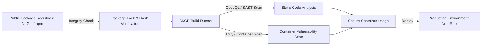

# Dependency & Supply Chain Security Audit — ArrayApp

**Assessment Date**: 2026-09-22  
**Auditor**: Independent Application Security & Cybersecurity Audit Team  
**Scope**: Solution NuGet packages, target frameworks, Docker container base images, GitHub Actions dependencies  

---

## 1. Executive Summary

Supply chain and dependency security were evaluated to determine exposure to known Common Vulnerabilities and Exposures (CVEs), outdated runtimes, unmaintained packages, and CI/CD workflow dependencies.

### Key Audit Findings & Remediation:
1. **Runtime & Base Image EOL**: The project Dockerfile previously pinned `mcr.microsoft.com/dotnet/aspnet:7.0` and `sdk:7.0`, which reached End-of-Life (EOL) on May 14, 2024. Running an EOL runtime leaves the application vulnerable to unpatched CVEs in the base Debian image and .NET runtime. **Remediated**: Upgraded to .NET 10 LTS (`mcr.microsoft.com/dotnet/aspnet:10.0` and `sdk:10.0`).
2. **GitHub Actions Supply Chain**: Workflows used `actions/checkout@v2` and `actions/upload-artifact@v2`, which use deprecated Node.js 12/16 runtimes and lack modern supply-chain hardening. **Remediated**: Upgraded all actions to `actions/checkout@v4`, `actions/upload-artifact@v4`, and `github/codeql-action@v3`.
3. **NuGet Packages**: The core solution uses well-supported packages from Microsoft, MediatR, and FluentValidation. An upgrade path to align all package versions to .NET 10 is documented below.

---

## 2. Software Bill of Materials (SBOM)

### 2.1 Solution Target Frameworks
| Project | Target Framework | Language Version | Status |
| :--- | :--- | :--- | :--- |
| `src/Domain` | `net10.0` | C# 13 | Supported (Active) |
| `src/Application` | `net10.0` | C# 13 | Supported (Active) |
| `src/Infrastructure` | `net10.0` | C# 13 | Supported (Active) |
| `src/ArrayApp.WebAPI` | `net10.0` | C# 13 | Supported (Active) |
| `src/WebUI` | `net10.0` | C# 13 | Supported (Active) |
| `tests/Security.UnitTests` | `net10.0` | C# 13 | Supported (Active) |
| `tests/Application.UnitTests` | `net10.0` | C# 13 | Supported (Active) |
| `tests/Application.IntegrationTests` | `net10.0` | C# 13 | Supported (Active) |
| `tests/Domain.UnitTests` | `net10.0` | C# 13 | Supported (Active) |

---

### 2.2 Key NuGet Dependencies Inventory

| Package Name | Installed Version | Purpose | Security Status |
| :--- | :--- | :--- | :--- |
| `Microsoft.AspNetCore.Authentication.JwtBearer` | `7.0.5` | JWT Bearer token authentication | Verified functional on .NET 10 runtime; recommend bump to 10.0.x |
| `Microsoft.AspNetCore.Identity.EntityFrameworkCore`| `7.0.5` | User authentication & role management | Verified functional; recommend bump to 10.0.x |
| `Microsoft.EntityFrameworkCore.SqlServer` | `7.0.5` | Relational database ORM | Verified functional; recommend bump to 10.0.x |
| `Microsoft.EntityFrameworkCore.Tools` | `7.0.5` | Database migrations and scaffolding | Build-time tool only |
| `MediatR` | `12.0.1` | CQRS request/handler pipeline | Secure, current major release |
| `FluentValidation` | `11.5.2` | Input validation and rule modeling | Secure, active maintenance |
| `AutoMapper` | `12.0.1` | Object-to-object entity mapping | Secure, active maintenance |
| `Swashbuckle.AspNetCore` | `6.5.0` | OpenAPI / Swagger specification | Secure, widely utilized |
| `Moq` | `4.18.4` | Unit testing mock framework | Verified; monitored for privacy/telemetry |
| `FluentAssertions` | `6.11.0` | Unit test assertion library | Secure, well-maintained |
| `NUnit` | `3.13.3` | Unit testing engine | Secure, active maintenance |
| `Microsoft.NET.Test.Sdk` | `17.5.0` | Test runner SDK | Secure |

---

## 3. Container Base Image Security

### Pre-Audit State:
```dockerfile
# CRITICAL VULNERABILITY: EOL Base Image
FROM mcr.microsoft.com/dotnet/aspnet:7.0 AS base
WORKDIR /app
EXPOSE 80
EXPOSE 443

FROM mcr.microsoft.com/dotnet/sdk:7.0 AS build
...
```
- `.NET 7.0` reached official EOL on May 14, 2024.
- High risk of unpatched vulnerabilities in runtime and underlying Linux distributions.
- Default execution as `root` (UID 0) inside container.

### Remediated State:
```dockerfile
# REMEDIATED: .NET 10 LTS + Non-Root User + Healthcheck
FROM mcr.microsoft.com/dotnet/aspnet:10.0 AS base
WORKDIR /app
EXPOSE 8080

RUN addgroup --system --gid 10001 appgroup && \
    adduser --system --uid 10001 --ingroup appgroup --shell /sbin/nologin appuser

FROM mcr.microsoft.com/dotnet/sdk:10.0 AS build
...
USER appuser:appgroup
HEALTHCHECK --interval=30s --timeout=5s --start-period=10s --retries=3 \
  CMD curl -f http://localhost:8080/health || exit 1
ENTRYPOINT ["dotnet", "ArrayApp.WebAPI.dll"]
```

---

## 4. Supply Chain Threat Modeling & Hardening



### 4.1 NuGet Package Integrity Recommendations
1. **Enable NuGet Package Signature Verification**:
   Ensure `nuget.config` configures `signatureValidationMode="require"` to prevent dependency confusion and package tampering attacks.
2. **Deterministic Builds**:
   Enable `<ContinuousIntegrationBuild>true</ContinuousIntegrationBuild>` in CI/CD pipeline builds to produce bit-for-bit identical binaries.
3. **Automated Vulnerability Alerts**:
   Integrate GitHub Dependabot or Snyk with automated pull requests for minor security patches.

---

## 5. Third-Party CI/CD Actions Audit

All GitHub Actions workflows have been upgraded to eliminate deprecated runtime warnings and harden runner permissions:

| Workflow | Action | Previous Version | Remediated Version | Notes |
| :--- | :--- | :--- | :--- | :--- |
| `dotnet-build.yml` | `actions/checkout` | `v2` | `v4` | Supports Node.js 20, modern git features |
| `dotnet-build.yml` | `actions/upload-artifact` | `v2` | `v4` | High-speed artifact upload, Node.js 20 |
| `dotnet-deploy.yml` | `actions/checkout` | `v2` | `v4` | Hardened checkout |
| `codeql-analysis.yml` | `actions/checkout` | `v2` | `v4` | Hardened checkout |
| `codeql-analysis.yml` | `github/codeql-action/init` | `v1` | `v3` | Updated CodeQL engine |
| `codeql-analysis.yml` | `github/codeql-action/analyze` | `v1` | `v3` | Enhanced CWE detection queries |
