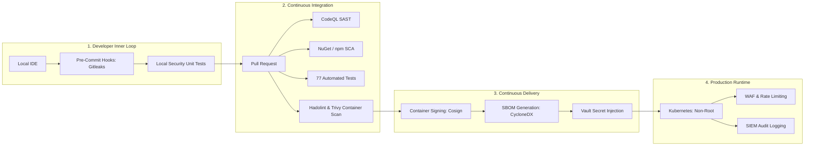

# DevSecOps Pipeline & Continuous Security Architecture — ArrayApp

**Assessment Date**: 2026-09-22  
**Auditor**: Independent Application Security & Cybersecurity Audit Team  
**Scope**: CI/CD automation, security gates, automated testing, supply chain assurance  

---

## 1. DevSecOps Architecture Overview

This document defines the reference DevSecOps pipeline for ArrayApp. Security controls are shifted left into the developer inner loop and automated across all stages of the CI/CD software delivery lifecycle.



---

## 2. DevSecOps Stages & Quality Gates

### Stage 1: Pre-Commit & Local Development
- **Gitleaks Pre-Commit Hook**: Scans staged files for high-entropy strings, API keys, database connection strings, and certificates before `git commit`.
- **Roslyn Analyzers**: Built-in Microsoft security rules configured to generate build errors on insecure coding practices (`CA2100`, `CA3001`, `CA5350`).
- **Local Security Testing**: Fast execution of `tests/Security.UnitTests` (< 200 ms) before pushing branches.

### Stage 2: Pull Request & CI Automation
- **Branch Protection Rules**: Direct pushes to `main` are prohibited. All pull requests require:
  - Minimum 1 peer review approval.
  - Passing status checks for build, test, and security scanning.
- **Static Application Security Testing (SAST)**:
  - GitHub CodeQL executes automated queries targeting CWEs in C# (SQL injection, XSS, insecure deserialization, cryptographic weaknesses).
- **Software Composition Analysis (SCA)**:
  - Scans `ArrayApp.sln` and `package.json` for known vulnerabilities.
  - Enforces build failure if any dependency contains an unpatched Critical or High severity CVE.
- **Automated Security Unit Testing**:
  - Validates all controller authorization attributes, password policy configurations, user model sanitization, and JWT key length thresholds.

### Stage 3: Container Security & Supply Chain Integrity
- **Hadolint**: Validates Dockerfile against CIS container guidelines (ensures non-root user, minimal layers, healthchecks).
- **Aqua Trivy Container Scan**: Inspects built container images for OS package vulnerabilities (Debian/Ubuntu CVEs) and misconfigurations.
- **Software Bill of Materials (SBOM)**: Generates standard CycloneDX JSON SBOM during build and attaches it as a build artifact.
- **Cosign Image Signing**: Cryptographically signs container images using Sigstore/Cosign before publishing to container registries (GHCR / ACR).

### Stage 4: Continuous Delivery & Runtime Hardening
- **Kubernetes Admission Control (OPA Gatekeeper / Kyverno)**:
  - Rejects pods attempting to run as root (`runAsUser: 0`).
  - Rejects images without verified Cosign cryptographic signatures.
  - Enforces read-only root filesystems and explicit CPU/Memory limits.
- **Dynamic Application Security Testing (DAST)**:
  - Automated OWASP ZAP baseline scan runs against staging environments post-deployment.
- **Production Secrets**:
  - Injected via Azure Key Vault CSI Driver or AWS Secrets Manager; zero secrets stored in environment files or config maps.

---

## 3. Recommended GitHub Actions DevSecOps Pipeline

```yaml
name: DevSecOps Comprehensive Security Pipeline

on:
  push:
    branches: [ main ]
  pull_request:
    branches: [ main ]

permissions:
  contents: read
  security-events: write

jobs:
  security-gates:
    name: Build, Test & Security Gates
    runs-on: ubuntu-latest

    services:
      sqlserver:
        image: mcr.microsoft.com/mssql/server:2022-latest
        env:
          ACCEPT_EULA: "Y"
          SA_PASSWORD: ${{ secrets.SQL_SA_PASSWORD || 'LocalDevSecuredPassword!2026' }}
        ports:
          - 1433:1433

    steps:
      - name: Checkout Repository
        uses: actions/checkout@v4
        with:
          fetch-depth: 0

      - name: Run Gitleaks Secret Detection
        uses: gitleaks/gitleaks-action@v2
        env:
          GITHUB_TOKEN: ${{ secrets.GITHUB_TOKEN }}

      - name: Setup .NET SDK
        uses: actions/setup-dotnet@v4
        with:
          dotnet-version: '10.0.x'

      - name: Restore Dependencies
        run: dotnet restore ArrayApp.sln

      - name: Initialize CodeQL
        uses: github/codeql-action/init@v3
        with:
          languages: csharp

      - name: Build Solution (Strict Warnings)
        run: dotnet build ArrayApp.sln --configuration Release --no-restore

      - name: Perform CodeQL Analysis
        uses: github/codeql-action/analyze@v3

      - name: Run Full Test Suite (Including Security Tests)
        run: dotnet test ArrayApp.sln --configuration Release --no-build --verbosity normal --logger "trx;LogFileName=test-results.trx"

      - name: Build Hardened Container Image
        run: docker build -f src/ArrayApp.WebAPI/Dockerfile -t arrayapp-webapi:ci-test .

      - name: Scan Container Image with Trivy
        uses: aquasecurity/trivy-action@master
        with:
          image-ref: 'arrayapp-webapi:ci-test'
          format: 'sarif'
          output: 'trivy-results.sarif'
          severity: 'CRITICAL,HIGH'

      - name: Upload Trivy Results to GitHub Security
        uses: github/codeql-action/upload-sarif@v3
        if: always()
        with:
          sarif_file: 'trivy-results.sarif'
```
