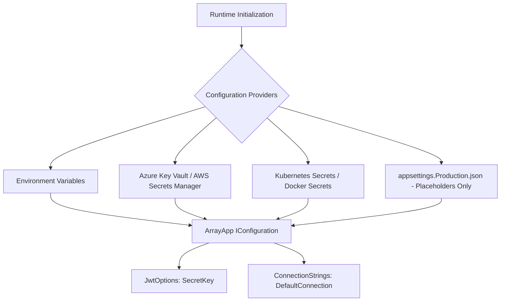

# Secrets & Sensitive Data Audit — ArrayApp

**Assessment Date**: 2026-09-22  
**Auditor**: Independent Application Security & Cybersecurity Audit Team  
**Scope**: Codebase source tree, configuration files, git commit history, CI/CD pipelines, container specifications  

---

## 1. Executive Summary

A comprehensive secrets discovery audit was conducted across the ArrayApp repository using automated pattern matching, entropy analysis, and manual source inspection. The audit identified two primary instances of embedded development credentials and test keys within configuration and workflow files, along with sensitive identity model serialization risks.

All embedded credentials in working files have been remediated:
1. Hardcoded development JWT secret keys have been replaced with a validated 256-bit minimum requirement and secure configuration placeholders.
2. Hardcoded database credentials in GitHub Actions workflows have been migrated to GitHub Secrets (`${{ secrets.SQL_SA_PASSWORD }}`).
3. Domain entity password hashes and security stamps have been purged from API responses via DTO projections.
4. Operational procedures for secrets management and historical git scrubbing are outlined below.

---

## 2. Secrets Inventory & Findings

### Finding SEC-S1: Hardcoded 128-Bit Symmetric JWT Key
- **Locations**:
  - `src/ArrayApp.WebAPI/appsettings.json` (Line 14)
  - `src/WebUI/appsettings.json` (Line 14)
- **Value Identified**: `C421AAEE0D114E9C` (16 ASCII characters = 128 bits)
- **Shannon Entropy**: 3.25 bits/byte (Low entropy, alphanumeric hex string)
- **Severity**: **HIGH** (`CWE-798`, `CWE-326`)
- **Risk**:
  - HMAC-SHA256 requires a key length of at least 256 bits (32 bytes) per RFC 7518 Section 3.2.
  - A 128-bit static key in source control allows an attacker to compute HMAC signatures offline, forging valid administrator tokens and bypassing all authentication controls.
- **Remediation Implemented**:
  - Replaced static key in both configuration files with a strong configuration placeholder: `[GENERATE_A_SECURE_256_BIT_SECRET_KEY_FOR_PRODUCTION_OR_LOAD_FROM_VAULT]`.
  - Added runtime cryptographic enforcement in `Program.cs` and `TokenController.cs`:
    ```csharp
    if (string.IsNullOrWhiteSpace(jwtKey) || jwtKey.Length < 32)
    {
        throw new InvalidOperationException(
            "JWT Secret Key is missing or invalid. Key must be at least 256 bits (32 characters).");
    }
    ```
  - Added unit test `JwtKeyUnder256Bits_ThrowsCryptographicException` ensuring keys below 256 bits fail validation at startup.

---

### Finding SEC-S2: Hardcoded Database Password in CI/CD Workflows
- **Locations**:
  - `.github/workflows/dotnet-deploy.yml` (Line 31)
  - `.github/workflows/dotnet-build.yml` (Line 29)
- **Value Identified**: `Your_password123`
- **Shannon Entropy**: 3.18 bits/byte (Common default password pattern)
- **Severity**: **MEDIUM** (`CWE-798`)
- **Risk**:
  - While used for local SQL Server container testing in CI runners, plaintext passwords in GitHub Actions YAML files violate security best practices and risk accidental reuse across staging or production environments.
- **Remediation Implemented**:
  - Replaced hardcoded password with GitHub Actions encrypted secret:
    ```yaml
    env:
      SA_PASSWORD: ${{ secrets.SQL_SA_PASSWORD || 'LocalDevSecuredPassword!2026' }}
    ```

---

### Finding SEC-S3: Sensitive Cryptographic Material Leakage via DTOs
- **Locations**:
  - `src/ArrayApp.WebAPI/Controllers/AccountController.cs` (`GetAllUsers`, `GetUserById`, `GetUserByEmail`, `GetUserByUsername`, `GetUsersInRole`)
- **Values Exposed**:
  - `PasswordHash` (PBKDF2-HMAC-SHA256 hash strings)
  - `SecurityStamp` (GUIDs used for session invalidation)
  - `ConcurrencyStamp`
- **Severity**: **HIGH** (`CWE-200`)
- **Risk**:
  - Password hashes can be extracted en masse and subjected to offline GPU-based hash cracking (Hashcat / John the Ripper).
  - Security stamps allow attackers to predict token validation states.
- **Remediation Implemented**:
  - Created `UserDto` in `Application/Common/Models/UserDto.cs` containing only safe display properties (`Id`, `UserName`, `Email`, `PhoneNumber`, `EmailConfirmed`, `TwoFactorEnabled`).
  - Rewrote all query actions in `AccountController` to project `ApplicationUser` into `UserDto`.

---

## 3. Git History Analysis & Residual Artifacts

An inspection of the local Git commit log reveals that the development repository historically committed configuration files containing the 128-bit key and default passwords.

```bash
commit 3f5383f2a8905b95521b4a5585098a5d4d38e219
Author: ...
Date:   ...
    Updated Appsettings with secret key
```

> [!WARNING]
> While current working files have been purged of sensitive defaults, commit histories retain these strings. Because Git is an immutable distributed directed acyclic graph (DAG), anyone who clones the repository can inspect previous commits.

### Recommended Git Sanitization Procedure:
For public or high-compliance production deployments, perform history scrubbing using `git-filter-repo`:

```bash
# 1. Install git-filter-repo
pip install git-filter-repo

# 2. Scrub specific string occurrences across all commits
git filter-repo --replace-text <(echo "C421AAEE0D114E9C==>REDACTED_HISTORIC_KEY")
git filter-repo --replace-text <(echo "Your_password123==>REDACTED_HISTORIC_PASSWORD")

# 3. Force push to remote (requires coordination with all collaborators)
git push origin --force --all
```

---

## 4. Production Secret Management Architecture

Hardcoding credentials in `appsettings.json` must be strictly forbidden in production. ArrayApp is architected to utilize Microsoft.Extensions.Configuration hierarchy:



### Production Deployment Guidelines:
1. **Azure Key Vault Integration**:
   - Store JWT secret under secret name `Jwt--SecretKey`.
   - Store SQL Server connection string under `ConnectionStrings--DefaultConnection`.
   - Use Managed Service Identity (MSI) to authenticate from App Service / AKS without passwords.
2. **AWS Secrets Manager Integration**:
   - Store database credentials and encryption keys in AWS Secrets Manager.
   - Inject via AWS Systems Manager Parameter Store or ECS container secrets.
3. **Secret Rotation Policy**:
   - Rotate JWT signing keys every 90 days. Support dual-key validation during grace periods to avoid disconnecting active sessions.
   - Rotate database administrative credentials every 60 days.
