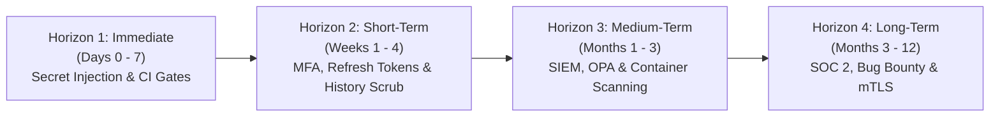

# Strategic & Tactical Security Roadmap — ArrayApp

**Assessment Date**: 2026-09-22  
**Auditor**: Independent Application Security & Cybersecurity Audit Team  
**Scope**: Post-remediation security lifecycle, enterprise maturity milestones, compliance horizons  

---

## 1. Roadmap Overview

This roadmap defines the prioritized evolutionary path for ArrayApp's security posture following the remediation of all critical and high severity vulnerabilities. It transitions the application from defensive hardening into active resilience, compliance readiness, and zero-trust maturity.

---

## 2. Horizon 1: Immediate Actions (Days 0 – 7)

| Objective | Target Area | Description | Owner | Priority |
| :--- | :--- | :--- | :--- | :--- |
| **Inject Production Secrets via Vault** | Deployment / Cloud | Remove placeholder JWT keys from `appsettings.json` in production environments and configure injection via Azure Key Vault or AWS Secrets Manager. | DevOps / SecOps | **P0 (Blocker)** |
| **Configure GitHub Actions Secrets** | CI/CD | Add `SQL_SA_PASSWORD` to repository GitHub Secrets settings so integration test workflows execute successfully without default fallbacks. | DevOps | **P0 (Blocker)** |
| **Integrate Security Tests into CI** | CI/CD | Add `dotnet test tests/Security.UnitTests/` to `dotnet-build.yml` to block any PR that reintroduces missing `[Authorize]` or weak policies. | DevSecOps | **P0 (Blocker)** |
| **Verify HSTS & HTTPS Redirection** | Network / Gateway | Ensure reverse proxies (Nginx, Traefik, Azure App Gateway) enforce TLS 1.3 and inject `Strict-Transport-Security: max-age=31536000; includeSubDomains; preload`. | Infra / SecOps | **P1 (High)** |

---

## 3. Horizon 2: Short-Term Initiatives (Weeks 1 – 4)

| Objective | Target Area | Description | Owner | Priority |
| :--- | :--- | :--- | :--- | :--- |
| **Refresh Token Architecture** | Authentication | Implement cryptographically secure Refresh Tokens stored in the database with one-time use rotation and revocation tables. | AppSec / Backend | **P1 (High)** |
| **Enforce Multi-Factor Authentication (MFA)** | Identity / Access | Mandate TOTP-based Two-Factor Authentication (Google/Microsoft Authenticator) for users assigned the `Administrator` role. | AppSec / Backend | **P1 (High)** |
| **Scrub Historical Git Commits** | Repository Hygiene | Execute `git-filter-repo` to permanently erase historical test keys and default passwords from the git DAG before opening the repository to contractors or public viewing. | SecOps | **P1 (High)** |
| **Enable Automated SCA (Dependabot / Snyk)** | Supply Chain | Enable Dependabot or Snyk in the GitHub repository for continuous monitoring and automated patching of NuGet and npm dependencies. | DevSecOps | **P2 (Medium)** |
| **Strict Anti-CSRF Protection** | Web Security | Verify and enforce ASP.NET Core Antiforgery tokens on all state-changing endpoints consumed by the Angular WebUI client. | Frontend / Backend | **P2 (Medium)** |

---

## 4. Horizon 3: Medium-Term Enhancements (Months 1 – 3)

| Objective | Target Area | Description | Owner | Priority |
| :--- | :--- | :--- | :--- | :--- |
| **Centralized SIEM Telemetry** | Monitoring / SecOps | Stream structured security audit logs (authentication attempts, role modifications, access evaluations) to Azure Sentinel, Splunk, or Datadog. | SecOps | **P2 (Medium)** |
| **Container Vulnerability Scanning in CI** | DevSecOps | Integrate Aqua Trivy or Anchore Grype into GitHub Actions to fail pipeline builds if container base images contain critical unpatched CVEs. | DevSecOps | **P2 (Medium)** |
| **Strict Content-Security-Policy (CSP) & Reporting** | Web Defense | Deploy nonce-based CSP headers with `report-to` directives to monitor and enforce strict script execution policies on the WebUI. | AppSec / Frontend | **P2 (Medium)** |
| **Fine-Grained ABAC with Open Policy Agent (OPA)** | Governance | Externalize complex authorization policies in `ZeroTrustGovernanceController` to Open Policy Agent (OPA) / Rego policies for auditable enterprise decision-making. | Architecture / AppSec | **P3 (Planned)** |

---

## 5. Horizon 4: Long-Term Enterprise Maturity (Months 3 – 12)

| Objective | Target Area | Description | Owner | Priority |
| :--- | :--- | :--- | :--- | :--- |
| **SOC 2 Type II & ISO 27001 Certification** | Compliance | Prepare formal audit evidence, continuous compliance monitoring, and access reviews to achieve enterprise SOC 2 Type II compliance. | CISO / Compliance | **P3 (Strategic)** |
| **Dynamic Application Security Testing (DAST)** | CI/CD / QA | Incorporate OWASP ZAP or Burp Suite Enterprise automated DAST scans into the staging deployment pipeline for continuous vulnerability detection. | QA / AppSec | **P3 (Strategic)** |
| **Public Bug Bounty Program** | Community Defense | Launch a private and eventually public vulnerability disclosure / bug bounty program on HackerOne or Bugcrowd. | CISO / AppSec | **P3 (Strategic)** |
| **Mutual TLS (mTLS) & Service Mesh** | Infrastructure | Deploy Istio or Linkerd service mesh across Kubernetes pods to enforce zero-trust cryptographic mutual TLS and fine-grained network policies between all services. | Cloud Architecture | **P3 (Strategic)** |
